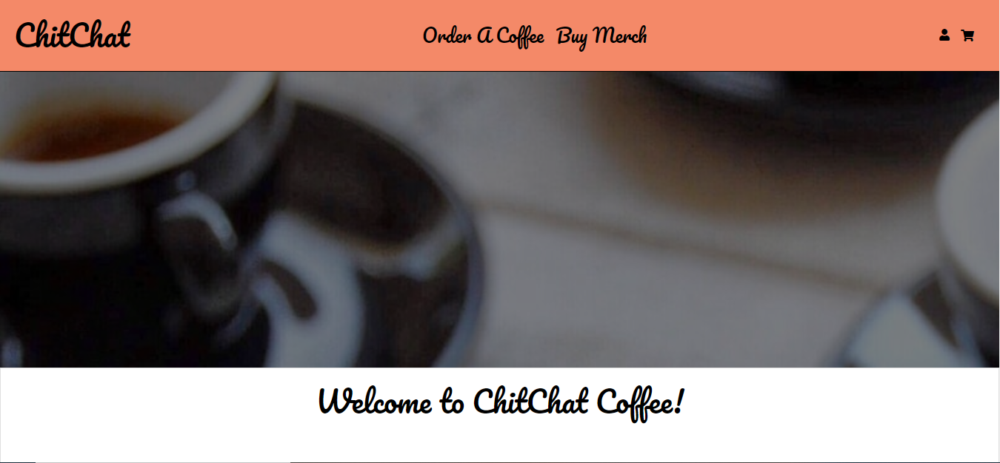
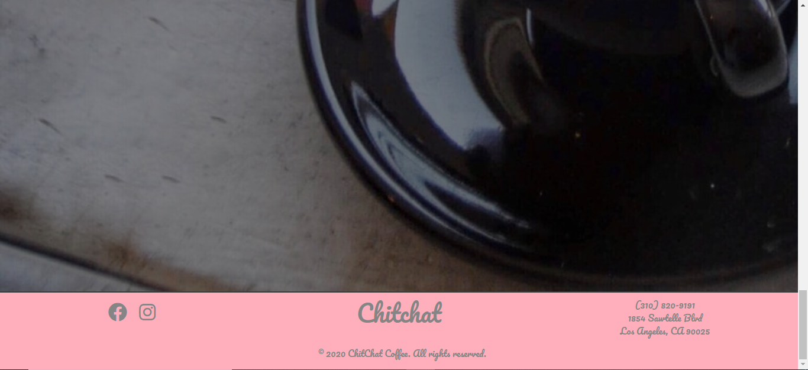
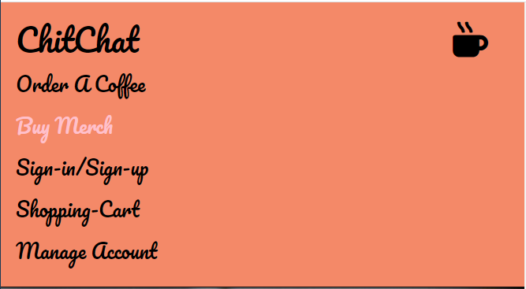
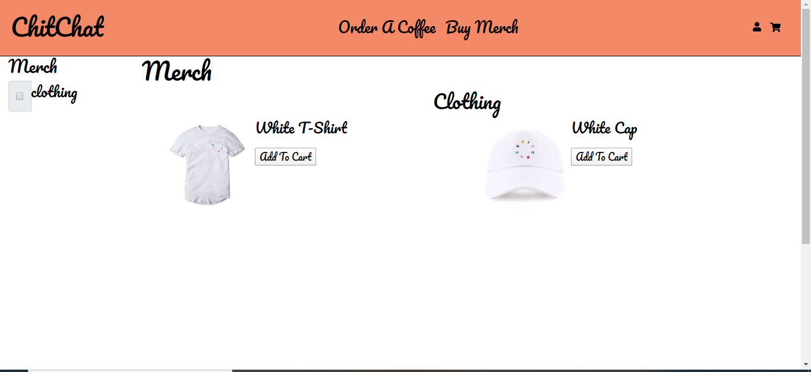
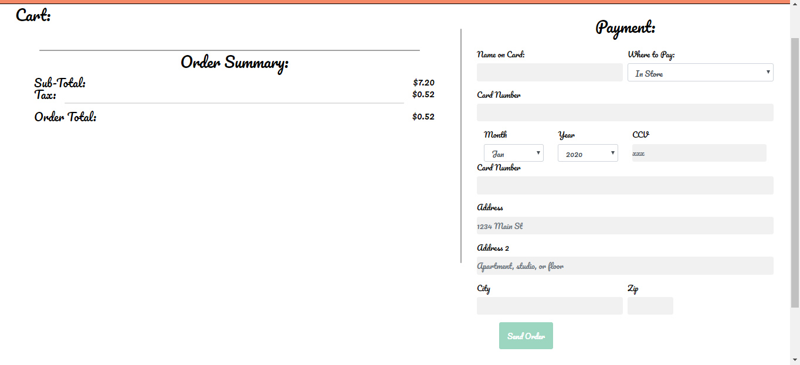
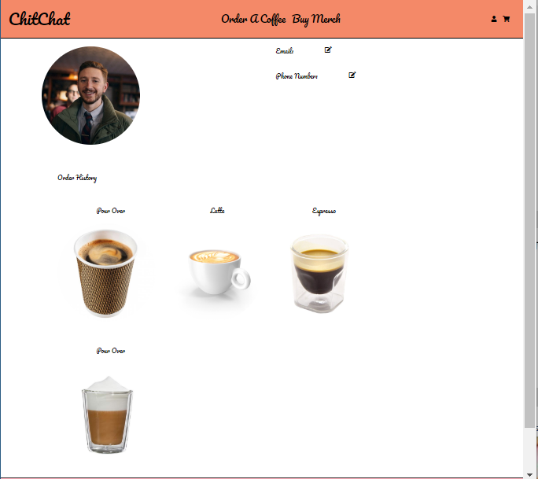
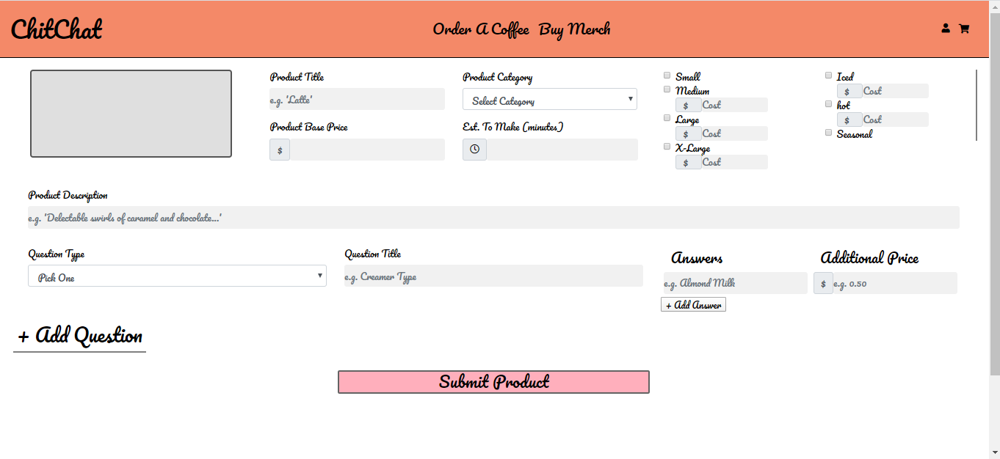
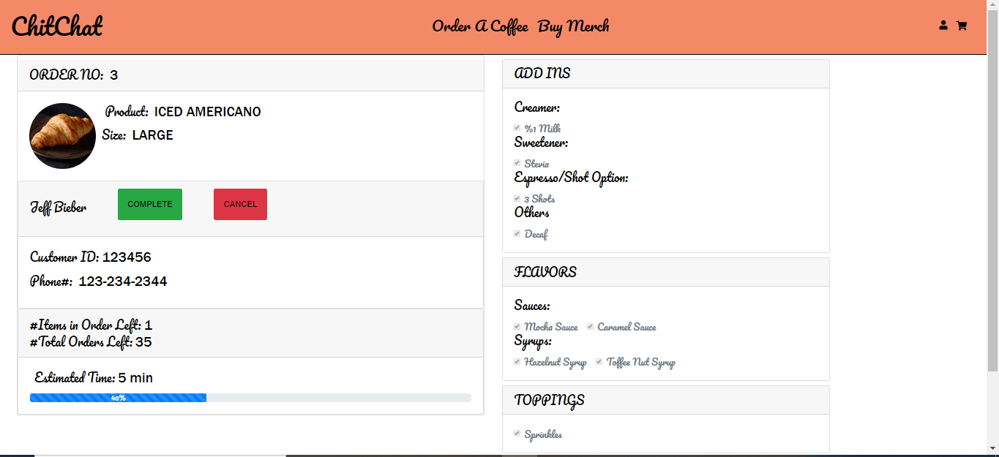

# CHIT-CHAT COFFEE APP

## Purpose

The task taken for this project was to redesign the website for the coffee shop called Chit-Chat Coffee located in West Los Angeles, CA. Their current website [Chit-Chat Coffee](https://chitchatla.com) is very simple and not practical because a customer can't order a drink through it. This new and improved website will allow for a person to place an order and pay for it all through the app. The barista will then be able to see the order placed and be able to send status updates to the customer regarding the order. The app breaks down into 2 sides: the customer interface and the administrator interface. 

## User Side of App

The following 4 screenshots show the main page layout if a user where to access the site through a desktop. We have a navigation bar with links to the main page (ChitChat logo), menu page ("Order A Coffee") and merch pages ("Buy Merch"). We also have a user account icon and a shopping cart icon for customer log-in and to see what is being purchased, respectively. At the bottom of the page we have the facebook and instagram icons to Chit-Chats accounts along with the phone number and address of the coffee shop. This footer and navigation bar a constant in all of the user side pages of the app.

The customer will most likely use the app through their phone and therefore the following screenshots show how the main page looks like. The main difference between the mobile and desktop versions is that the "Order a Coffee" link is centered on the page and the navigation bar expands when the coffee cup is icon is clicked. When it is clicked it reveals links to access the user side pages of the app.

If the customer navigates to these pages either through the mobile or desktop versions they are able to then see the entire coffee selection that Chit-Chat offers or they could purchase merchandise they sell. Note that this pages are still under construction and will be populated at a later date. 

After the customer places an order or purchases merchandise they will be taken to the checkout page. This page will give them a detailed summary of what they will order or purchase and a form wher they can selec to pay in-store or with a credit card by providing their card's information. This page is under construction as well; to be finished at a later time. 

In order for the customer to place an order or purchase they will need to create an account as shown in the first screenshot and then they will be taken to their account. Once in their account they will be able to access their purchase history along with their basic contact information. Just like previous pages this page is a work in progress and will be modified later. 

## Admin Side of App

A barista or the owner of the coffeee shop will be able to modify their menu using the page in the first screenshot. This will come in handy because it is assumed that their menu is ever evolving depending on the season or demand of products. Also the barista making a drink will be able give status updates to a customer as seen in the second screenshot. The barista will be able to see who the customer is and what if any modifications they made to their orders. Eventually the app will be able to send text message notifications to customers when their orders are done. 

## Challenges & ToDos

The two main challenges we are still figuring out as a team is being able to integrate all of the pages from beginnning to end including integrating our database and working with Stripe API in order to take and process online payments. These two items cause us trouble because we are relatively new to using them so much of our time was taken researching how to integrate/use them. Given that this app is a works in progress we should be able to overcome these challenges in due time. 

  
  
  
